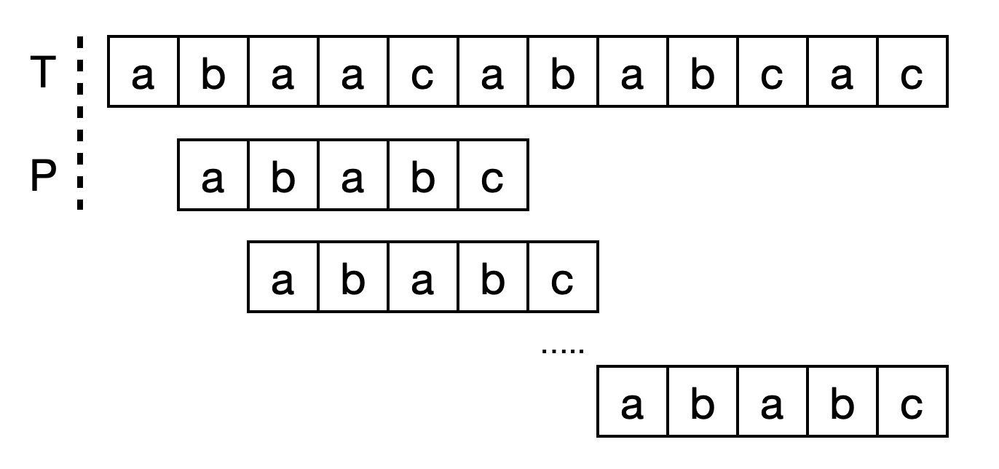
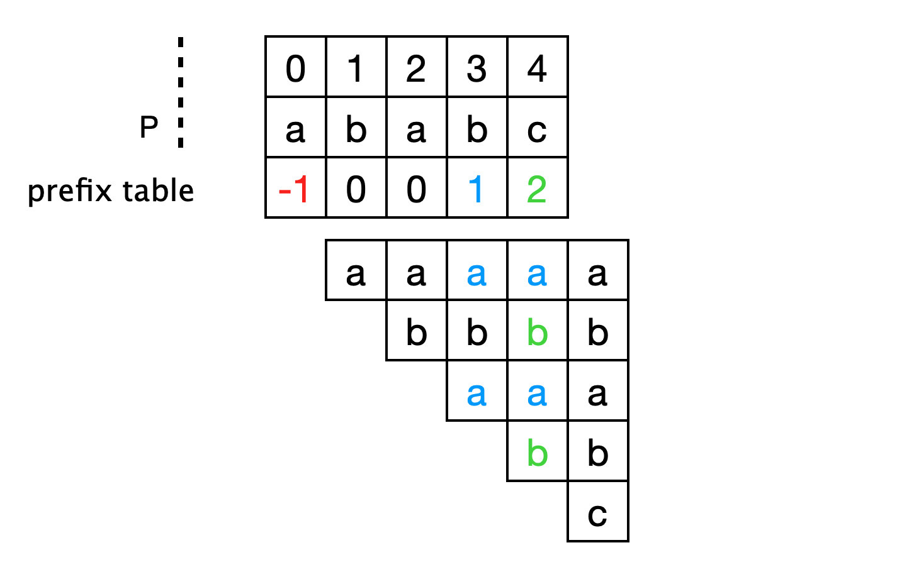
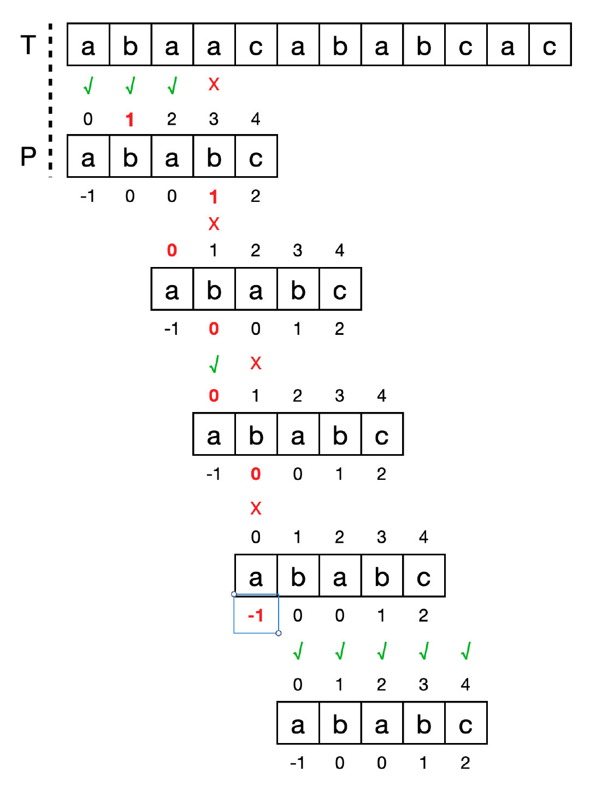

## 二分查找（非递归）

### 介绍

- 二分查找分为两种：递归和非递归
- 一般情况只适用于从有序的数列中进行查找，或者将数列进行排序后进行查找
- 时间复杂度为O(log2n)

### 代码实现

数组 {1,3, 8, 10, 11, 67, 100}, 编程实现二分查找， 要求使用非递归的方式完成.

```java
private static int binarySearch(int[] arr, int target){
    //定义结果，左节点和右节点
    int res = -1, left = 0, right = arr.length-1;
	//使用while循环 左右节点相等时退出循环
    while(left <= right){
        int mid = (left + right) / 2;
        if(arr[mid] == target){
            return mid;
        }else if(arr[mid] > target){
            right = mid;
        }else{
            left = mid;
        }
    }
    return res;
}
```

最好使用`[]`的区间，使用`(]`或`[)`

<!-- more -->

## 分治算法(Divide-and-Conquer(P))

### 介绍

分治法在每一层递归上都分成三个步骤

- 分解：将原问题分解成为若干个规模较小，相互独立，与原问题形式相同的子问题
- 解决：若子问题能直接解决则直接解决，否则将子问题分成更小的子问题解决
- 合并：将各个子问题的解合并成为原问题的解

### 代码实现

汉诺塔案例：**汉诺塔**是根据一个传说形成的数学问题：

有三根杆子A，B，C。A杆上有 N 个 (N>1) 穿孔圆盘，盘的尺寸由下到上依次变小。要求按下列规则将所有圆盘移至 C 杆：

1. 每次只能移动一个圆盘；
2. 大盘不能叠在小盘上面。

提示：可将圆盘临时置于 B 杆，也可将从 A 杆移出的圆盘重新移回 A 杆，但都必须遵循上述两条规则。

问：如何移？最少要移动多少次？

```java
public static void hanoiTower(int num, char a, char b, char c) {
    //如果只有一个盘
	if(num == 1) {
	System.out.println("第 1 个盘从 " + a + "->" + c);
    } else {
		//如果我们有 n >= 2 情况，我们总是可以看做是两个盘 1.最下边的一个盘 2. 上面的所有盘 
        //1. 先把 最上面的所有盘 A->B， 移动过程会使用到 c
		hanoiTower(num - 1, a, c, b);
		//2. 把最下边的盘 A->C
		System.out.println("第" + num + "个盘从 " + a + "->" + c);
		//3. 把B塔的所有盘 从 B->C , 移动过程使用到 a塔
		hanoiTower(num - 1, b, a, c);
	} 
}
```

## 动态规划(DP)

### 介绍

（英语：Dynamic programming，简称DP）是一种在[数学](https://zh.wikipedia.org/wiki/数学)、[管理科学](https://zh.wikipedia.org/wiki/管理科学)、[计算机科学](https://zh.wikipedia.org/wiki/计算机科学)、[经济学](https://zh.wikipedia.org/wiki/经济学)和[生物信息学](https://zh.wikipedia.org/wiki/生物信息学)中使用的，通过把原问题分解为相对简单的子问题的方式求解复杂问题的方法。

动态规划常常适用于有重叠子问题和最优子结构性质的问题，动态规划方法所耗时间往往远少于朴素解法。

动态规划背后的基本思想非常简单。大致上，若要解一个给定问题，我们需要解其不同部分（即子问题），再根据子问题的解以得出原问题的解。

通常许多子问题非常相似，为此动态规划法试图仅仅解决每个子问题一次，从而减少计算量：一旦某个给定子问题的解已经算出，则将其记忆化存储，以便下次需要同一个子问题解之时直接查表。这种做法在重复子问题的数目关于输入的规模呈指数增长时特别有用。

### 代码实现

背包问题描述：

有N件物品和一个容量为V的背包。第i件物品的费用是`c[i]`，价值是`w[i]`。求解将哪些物品装入背包可使价值总和最大。

基本思路 ：
这是最基础的背包问题，特点是：每种物品仅有一件，可以选择放或不放。 用子问题定义状态：即`f[i][v]`表示前`i`件物品恰放入一个容量为`v`的背包可以获得的最大价值。则其状态转移方程便是：

`tab[i][j] = max(tab[i-1][j-weight[i]]+value[i],tab[i-1][j]) ({i,j|0<i<=n,0<=j<=total})`

```java
for(int i = 1; i <= n; i++){
     for(int j = W; j >= w[i]; j--)
        dp[j] = max(dp[j], dp[j - w[i] + v[i]);
}
```

## KMP算法

### 介绍

#### 字符串匹配介绍

这是字符串匹配（查找）经常使用的一种算法，


如上图所示在在字符串T中匹配字符串P：

最简单的方法是使用暴力匹配，即将T中的每一个字母挨个与P中的第一个字母匹配，T中后面一个字母与P中第二个字母匹配。



这样的算法最坏的情况下的时间复杂度为`O(T.lenth()*P.length())`


#### 前缀表(prefix table)

我们首先考虑例子`P = "ababc"`。使用这个大致相同的模式串作为主搜索，我们将会看到它高效的原因。

首先，我们设定`W[0] = -1`。为了找到`W[1]`，我们必须找到一个`"a"`的适当后缀同时也是`P`的前缀。但`"a"`没有后缀，所以我们设定`W[1] = 0`。类似地，`W[2] = 0`。

当我们继续到`W[3]`由于`P[0] == P[2] == a`，所以我们得到`W[3] = 1`。

并且我们总结出规律，对于`W[i]（i>0)`而言，若`P[i-1] == P[W[i-1]]`则`W[i]=W[i-1]+1`,否则`T[i] = 0`。

根据上述规律，我们得到`W = [-1,0,0,1,2]`。可以直观的从下图中看出。



在得到前缀表之后可以按照下面的方法开始比对



与暴力匹配不同的地方在于，当匹配失败时，即`T[i] != P[j]`时，移动`P`，使得`P[W[j]]`对应`T[i]`。若`W[j] == 0`则令`P[W[j]+1]`对应`T[i+1]`。

### 代码实现

理解之后，代码比较简单。

```java
private static int KMP(String longString, String target) {

    int[] prefixTable = new int[target.length()];
    prefixTable[0] = -1;
    prefixTable[1] = 0;
    //获取前缀表
    for (int i = 2; i < target.length(); i++) {
        if(target.charAt(i - 1) == target.charAt(prefixTable[i-1])){
            prefixTable[i] = prefixTable[i-1] + 1;
        }else{
            prefixTable[i] = 0;
        }
    }

    int index = 0, indexTarget = 0;
    while (index < longString.length()){
		//比较通过
        if (longString.charAt(index) == target.charAt(indexTarget)){
            index ++;
            indexTarget ++;
        }else{
            //比较不通过，且[indexTarget] == -1
            if (prefixTable[indexTarget] == -1){
                index ++;
                indexTarget = 0;
            }else{
                //比较不通过，且[indexTarget] ！= -1
                indexTarget = prefixTable[indexTarget];
            }
        }
        //比较成功返回索引
        if (indexTarget == target.length()){
            return index;
        }
    }
    return -1;

}
```

## 贪心算法

**贪心算法**（英语：greedy algorithm），又称**贪婪算法**，是一种在每一步选择中都采取在当前状态下最好或最优（即最有利）的选择，从而希望导致结果是最好或最优的[算法](https://zh.wikipedia.org/wiki/算法)。比如在[旅行推销员问题](https://zh.wikipedia.org/wiki/旅行推销员问题)中，如果旅行员每次都选择最近的城市，那这就是一种贪心算法。

贪心算法在有最优子结构的问题中尤为有效。最优子结构的意思是局部最优解能决定全局最优解。简单地说，问题能够分解成子问题来解决，子问题的最优解能递推到最终问题的最优解。

贪心算法与[动态规划](https://zh.wikipedia.org/wiki/动态规划)的不同在于它对每个子问题的解决方案都做出选择，不能回退。动态规划则会保存以前的运算结果，并根据以前的结果对当前进行选择，有回退功能。

贪心法可以解决一些[最优化](https://zh.wikipedia.org/wiki/最优化)问题，如：求[图](https://zh.wikipedia.org/wiki/图)中的[最小生成树](https://zh.wikipedia.org/wiki/最小生成树)、求[哈夫曼编码](https://zh.wikipedia.org/wiki/哈夫曼编码)……对于其他问题，贪心法一般不能得到我们所要求的答案。一旦一个问题可以通过贪心法来解决，那么贪心法一般是解决这个问题的最好办法。由于贪心法的高效性以及其所求得的答案比较接近最优结果，贪心法也可以用作辅助算法或者直接解决一些要求结果不特别精确的问题。

## 回溯算法

**解决一个回溯问题，实际上就是一个决策树的遍历过程**。

1、路径：也就是已经做出的选择。

2、选择列表：也就是你当前可以做的选择。

3、结束条件：也就是到达决策树底层，无法再做选择的条件。

回溯算法最经典的问题是八皇后问题

```java
result = []
def backtrack(路径, 选择列表):
    if 满足结束条件:
        result.add(路径)
        return
    for 选择 in 选择列表:
        做选择
        backtrack(路径, 选择列表)
        撤销选择
```

核心就是 for 循环里面的递归，在递归调用之前「做选择」，在递归调用之后「撤销选择」


