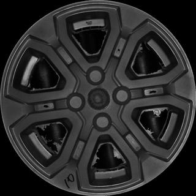
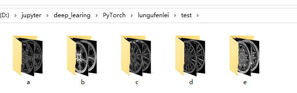

背景是研究生阶段准备做的项目和研究方向，实验室和金华今飞集团合作，主要是智能制造方向，目前的研究目标的汽车轮毂的分类等。

## 原始数据处理

原始数据是师兄给的，是工厂采集好的样品，如下图所示约有20个类型几万张图片



在准备开始我的学习之前，我从原始数据中取出5类轮毂，文件结构如下所示：

<!-- more -->

```
data
    -text
        -a(类型为a的数据）
        -b……
        -c……
        -d……
        -e……
    -train
        -a……
        -b……
        -c……
        -d……
        -e……
```

test文件夹下的结构如下图所示



在初始的调试阶段第一步是将载入数据集

```python
import torch
import torchvision
from torchvision import transforms
from torch.autograd import Variable
# 导入需要的库
img_data_train = torchvision.datasets.ImageFolder(root1,
                                            transform=transforms.Compose([
                                                transforms.Resize(20),
                                                transforms.CenterCrop(20),
                                                transforms.ToTensor()])
                                            )
# transforms.Resize(20)：将原来的图片进行大小变换成20*20
# transforms.CenterCrop（20）：将上一步的图片进行中心剪裁成20*20
# transforms.ToTensor()：将图片的数据转为tensor类型

img_data_test = torchvision.datasets.ImageFolder(root2,
                                            transform=transforms.Compose([
                                                transforms.Resize(20),
                                                transforms.CenterCrop(20),
                                                transforms.ToTensor()])
                                            )
# root1,root2分别为两个根目录
# print(len(img_data_train))
data_loader_train = torch.utils.data.DataLoader(img_data_train, batch_size=1,shuffle=True)
data_loader_test = torch.utils.data.DataLoader(img_data_test, batch_size=1,shuffle=True)
# torch.utils.data.DataLoader(）函数为加载数据库，元素分别为根目录，batch_size shuffle
```

导入之后可以展示batch内的数据（这里的batch取值和显卡内存相关）

```python
# print(len(data_loader_train))
images, labels = next(iter(data_loader_train))
labels=labels.numpy()
img = torchvision.utils.make_grid(images)
classes=('a', 'b', 'c', 'd','e','f')
img = img.numpy().transpose(1,2,0)
std = [0.5,0.5,0.5]
mean = [0.5,0.5,0.5]
img = img*std + mean
# print([classes[labels[i]-1] for i in range(20)])
# plt.imshow(img)
```

## 网络模型的构建

在这里我们搭建了一个包含卷积层、激活函数、池化层、全连接层的卷积神经网络。

* 卷积层使用torch.nn.Conv2d类方法构建
* 激活层使用torch.nn.ReLU类方法构建
* 池化层使用torch.nn.MaxPool2d类方法构建
* 全连接层使用torch.nn.Linear类方法构建

这四个函数的具体内容将在另外一篇blog中介绍。

```python
class Model(torch.nn.Module):
    
    def __init__(self):
        super(Model, self).__init__()
        self.conv1=torch.nn.Sequential(
            torch.nn.Conv2d(1,64,kernel_size=3,stride=1,padding=1),
            torch.nn.ReLU(),
            torch.nn.Conv2d(64,128,kernel_size=3,stride=1,padding=1),
            torch.nn.ReLU(),
            torch.nn.MaxPool2d(stride=2,kernel_size=2))
        self.dense=torch.nn.Sequential(
            torch.nn.Linear(12800,1024),
            torch.nn.ReLU(),
            torch.nn.Dropout(p=0.5),
            torch.nn.Linear(1024, 5))
        
    def forward(self, x):
        x = self.conv1(x)
        x = x.view(-1, 12800)
        x = self.dense(x)
        return x
```

为了能启用GPU加速运算，这里加上了使用GPU的部分代码。

```python
model = Model()
# print(model)
device = torch.device("cuda:0" if torch.cuda.is_available else "cpu")
#device = torch.device("cpu")
print(device)
model.to(device)
```

定义损失函数和优化函数

```python
cost = torch.nn.CrossEntropyLoss()
optimizer = torch.optim.Adam(model.parameters())
```

## 模型的训练和验证

最后卷积神经网络模型进行模型优化和参数优化的代码如下

```python
n_epochs = 10
# 定义训练次数
for epoch in range(n_epochs):
    running_loss = 0.0
    running_correct = 0
    print("Epoch {}/{}".format(epoch, n_epochs))
    print("-"*10)
    
    for data in data_loader_train:
        X_train, y_train = data
        X_train, y_train = Variable(X_train), Variable(y_train)
        X_train=X_train.to(device)
        y_train=y_train.to(device)
        outputs = model(X_train)
        _,pred = torch.max(outputs.data, 1)
        optimizer.zero_grad()
        loss = cost(outputs, y_train)
        
        loss.backward()
        optimizer.step()     
        running_loss += loss.data
        running_correct += torch.sum(pred == y_train.data)

    testing_correct = 0    
    for data in data_loader_test:
        X_test, y_test = data
        X_test, y_test = Variable(X_test), Variable(y_test)
        X_test=X_test.to(device)
        y_test=y_test.to(device)
        
        outputs = model(X_test)
        _, pred = torch.max(outputs.data, 1)
        testing_correct += torch.sum(pred == y_test.data)
    print("Loss is:{:.4f}, Train Accuracy is:{:.4f}%, Test Accuracy is:{:.4f}%".format(running_loss/len(data_loader_train),100*running_correct/len(data_loader_train),
                 100*testing_correct/len(data_loader_test)))
```

最后打印出输出结果

```
Epoch 7/10
----------
Loss is:0.0952, Train Accuracy is:96.0000%, Test Accuracy is:95.0000
Epoch 8/10
----------
Loss is:0.0947, Train Accuracy is:99.0000%, Test Accuracy is:99.0000
Epoch 9/10
----------
Loss is:0.1241, Train Accuracy is:100.0000%, Test Accuracy is:100.0000
```

## 总结

可以看到模型的训练结果还是非常不错的，在测试集和训练集都能达到很高的水平。
至此一个简单的卷积神经网络训练图片分类问题就得到了解决。
但是这里仍然有许多其他问题没有得到解决。