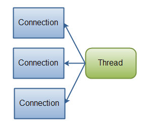
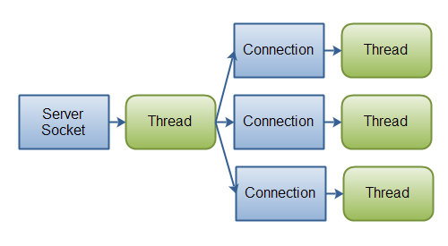

## Java IO 的原理

IO是input和output的缩写，IO技术是非常实用的技术，用于处理设备之间的数据传输。例如读写文件，网络通讯等等。

Java程序中，对于数据的输入输出都是以“流(stream)”的方式进行

`java。io`包下提供了各种流的接口和类，用以获取不同种类的数据，并通过标准的方法输入或输出数据。

流的分类：

- 按照操作数据单位，分为字节流和字符流
- 按照数据流向：输入流和输出流
- 按照流的角色：节点流和处理流

| 抽象基类 | 字节流       | 字符流 |
| -------- | ------------ | ------ |
| 输入流   | InputStream  | Reader |
| 输出流   | OutputStream | Writer |

<!-- more -->

## 字符流读写文件

读取文件

```java
public static void main(String[] args) throws IOException {
    File file = new File("IO/src/main/resources/1.txt");
    System.out.println(file.getAbsolutePath());
    FileReader fileReader = new FileReader(file);
    int read = fileReader.read(); //返回读入的字符,如果达到文件末尾则返回-1
    while(read != -1){
        System.out.println((char) read);
        read = fileReader.read();
    }
    fileReader.close();
} 
```

写出文件

```java
@Test
public void fileWriteTest() throws IOException{
    File file = new File("src/main/resources/1.txt");
    FileWriter fileWriter = new FileWriter(file,true); //是否追加
    fileWriter.write("你好\n");  //覆盖
    fileWriter.close(); // 流的关闭
}
```

读写文件(文本文件)

```java
@Test
public void fileCopyTest() throws IOException{
    File file1 = new File("src/main/resources/1.txt");
    File file2 = new File("src/main/resources/2.txt");
    FileReader fileReader = new FileReader(file1);
    FileWriter fileWriter1 = new FileWriter(file2);

    char[] chars = new char[5];
    int len;
    while((len = fileReader.read(chars)) != -1){
        fileWriter1.write(chars,0,len);
    }

    fileReader.close();
    fileWriter1.close();
}
```

## 字节流读写文件

读写非文本文件

```java
@Test
public void jpgCopyTest() throws IOException{
    File file1 = new File("src/main/resources/1.jpg");
    File file2 = new File("src/main/resources/2.jpg");
    FileInputStream fileInputStream = new FileInputStream(file1);
    FileOutputStream fileOutputStream = new FileOutputStream(file2);

    byte[] chars = new byte[5];
    int len;
    while((len = fileInputStream.read(chars)) != -1){
        fileOutputStream.write(chars,0,len);
    }

    fileInputStream.close();
    fileOutputStream.close();
}
```

## 使用缓冲流读写文件

```java
@Test
public void bufferTest() throws IOException{
    File file1 = new File("src/main/resources/1.jpg");
    File file2 = new File("src/main/resources/2.jpg");
    FileInputStream fileInputStream = new FileInputStream(file1);
    FileOutputStream fileOutputStream = new FileOutputStream(file2);

    BufferedInputStream bufferedInputStream = new BufferedInputStream(fileInputStream);
    BufferedOutputStream bufferedOutputStream = new BufferedOutputStream(fileOutputStream);
    
    byte[] chars = new byte[10];
    int len;
    while((len = bufferedInputStream.read(chars)) != -1){
        bufferedOutputStream.write(chars,0,len);
    }

    bufferedInputStream.close();
    bufferedOutputStream.close();
    fileInputStream.close();
    fileOutputStream.close();
}
```

提高读写速度的原因，内部提供了一个缓冲区

处理流就是套接在已有的流的基础之上的流

## 转换流 

```java
FileInputStream fileInputStream = new FileInputStream(file1);
FileOutputStream fileOutputStream = new FileOutputStream(file2);

InputStreamReader inputStreamReader = new InputStreamReader(fileInputStream, "UTF-8");
OutputStreamWriter outputStreamWriter = new OutputStreamWriter(fileOutputStream);
```

将字节流转换为字符流

## 其他流

### 标准输入输出流

`system.in`标准输入流，从控制台的键盘输入，类型是`InputStream`

`System.out`标准输出流，输出到控制台，类型是`PrintStream`

### 打印流

`printStream`打印字符

`printWriter`打印字节

实现将基本数据类型转化为字符输出提供了一系列的`print()`

### 数据流

`DataInputStream`

`DataOutputStream`

数据输入输出流

## NIO和IO(转载)

### 简介

NIO即New IO，也可以理解为`Non-blocking`。这个库是在JDK1.4中才引入的。NIO和IO有相同的作用和目的，但实现方式不同，NIO主要用到的是块，所以NIO的效率要比IO高很多。在Java API中提供了两套NIO，一套是针对标准输入输出NIO，另一套就是网络编程NIO。

### 两者区别

| **IO** | **NIO**  |
| ------ | -------- |
| 面向流 | 面向缓冲 |
| 阻塞IO | 非阻塞IO |
| 无     | 选择器   |

- 面向流与面向缓冲

   Java IO和NIO之间第一个最大的区别是，IO是面向流的，NIO是面向缓冲区的。 Java IO面向流意味着每次从流中读一个或多个字节，直至读取所有字节，它们没有被缓存在任何地方。此外，它不能前后移动流中的数据。如果需要前后移动从流中读取的数据，需要先将它缓存到一个缓冲区。 Java NIO的缓冲导向方法略有不同。数据读取到一个它稍后处理的缓冲区，需要时可在缓冲区中前后移动。这就增加了处理过程中的灵活性。但是，还需要检查是否该缓冲区中包含所有您需要处理的数据。而且，需确保当更多的数据读入缓冲区时，不要覆盖缓冲区里尚未处理的数据。

- 阻塞与非阻塞IO

   Java IO的各种流是阻塞的。这意味着，当一个线程调用read() 或 write()时，该线程被阻塞，直到有一些数据被读取，或数据完全写入。该线程在此期间不能再干任何事情了。Java NIO的非阻塞模式，使一个线程从某通道发送请求读取数据，但是它仅能得到目前可用的数据，如果目前没有数据可用时，就什么都不会获取，而不是保持线程阻塞，所以直至数据变的可以读取之前，该线程可以继续做其他的事情。 非阻塞写也是如此。一个线程请求写入一些数据到某通道，但不需要等待它完全写入，这个线程同时可以去做别的事情。 线程通常将非阻塞IO的空闲时间用于在其它通道上执行IO操作，所以一个单独的线程现在可以管理多个输入和输出通道（channel）。

- 选择器(Selectors)

   Java NIO的选择器允许一个单独的线程来监视多个输入通道，你可以注册多个通道使用一个选择器，然后使用一个单独的线程来“选择”通道：这些通道里已经有可以处理的输入，或者选择已准备写入的通道。这种选择机制，使得一个单独的线程很容易来管理多个通道。

### 具体内容

NIO可让您只使用一个（或几个）单线程管理多个通道（网络连接或文件），但付出的代价是解析数据可能会比从一个阻塞流中读取数据更复杂。

如果需要管理同时打开的成千上万个连接，这些连接每次只是发送少量的数据，例如聊天服务器，实现NIO的服务器可能是一个优势。同样，如果你需要维持许多打开的连接到其他计算机上，如P2P网络中，使用一个单独的线程来管理你所有出站连接，可能是一个优势。一个线程多个连接的设计方案如下图所示：



**Java NIO: 单线程管理多个连接**

如果你有少量的连接使用非常高的带宽，一次发送大量的数据，也许典型的IO服务器实现可能非常契合。下图说明了一个典型的IO服务器设计：



**Java IO: 一个典型的IO服务器设计- 一个连接通过一个线程处理.**


来源 https://www.cnblogs.com/xiaoxi/p/6576588.html


