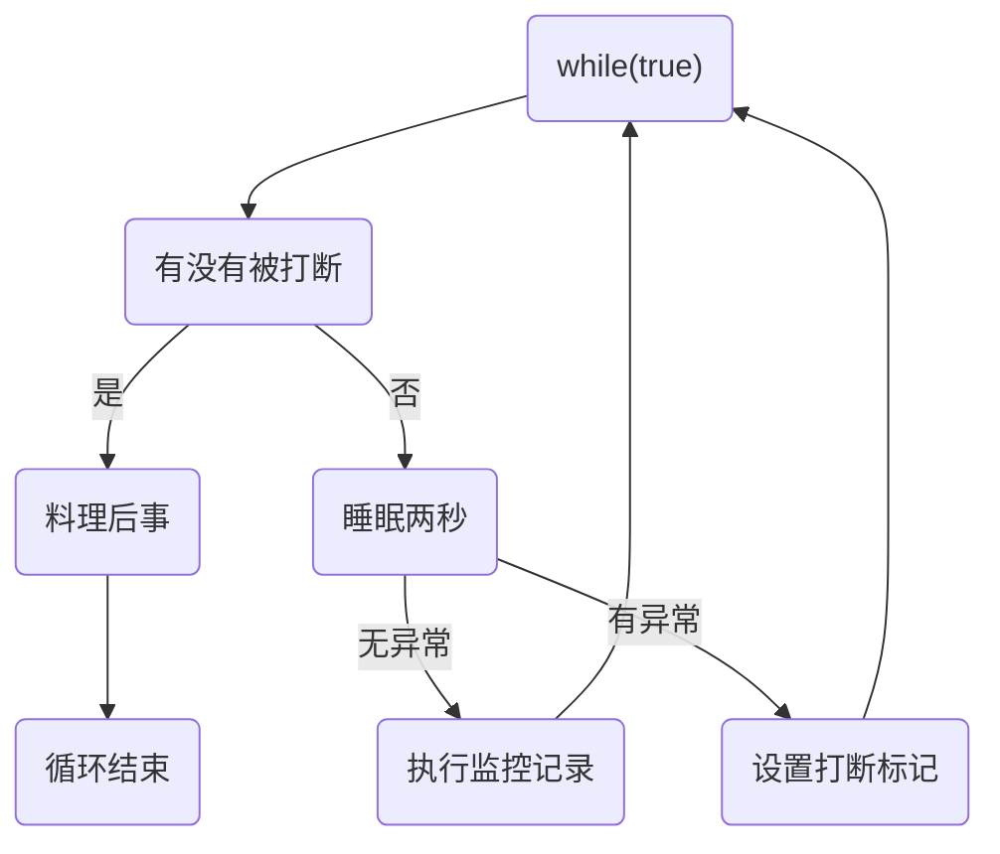

## 基本概念

- 程序(program)： 是为完成特定任务，用某种语言编写的一组指令的集合。即值一段静态代码，静态对象。
- 进程(progress)：是程序的一次执行过程，或是正在运行的一个程序。是一个动态的过程：有它的产生、存在和消亡的过程。--生命周期
- 进程作为资源分配的单位，系统在运行时为每个进程分配不同的内存区域
- 线程(thread)：进程可进一步细化为线程，是程序内部的一条执行路径。
  - 若一个京城同一时间并行执行多个线程，就是支持多线程的
  - 线程作为调度和执行的单位，每个线程有独立的运行栈和程序计数器，线程切换的开销小
  - 一个进程中的多个线程共享相同的内存单元/内存地址空间->他们从同一堆中访问对象，可以访问相同的变量和对象。这就使得线程之间的通信你好忙的很简便高效。但是多个线程操作共享的系统资源就会带来一定的安全隐患。
- 并行和并发
  - 并行：多个CPU同时执行多个任务。比如：多个人同时做不同的事
  - 并发：一个CPU(采用时间片)同时执行多个任务。比如：秒杀
- 同步和异步
  - 需要等待结果返回才能继续运行就是同步
  - 不需要等待结果返回就能继续运行就是异步
- 多线程的优点：
  - 提高应用程的响应。对图形化界面更有意义，可增强用户体验
  - 提高计算机系统的CPU利用率
  - 改善程序结构，将长而且复杂的进程分为多个线程，独立运行，利与理解和修改。
- 合适需要多线程

  - 程序需要同时执行两个或者多个任务
  - 程序需要实现一些需要等待的任务时，如用户输入、文件读写、网络操作、搜索等
  - 需要一些后台运行的程序时

<!--more-->


## 多线程的创建与应用

### 方式一：继承与Thread类的子类

1. 创建一个继承与Thread类的子类
2. 重写Thread类的run()方法
3. 创建Thread子类的对象
4. 通过该对象调用start()

```java
class MyThred extends Thread{
    @Override
    public void run() {
        for (int i = 0; i < 100; i+=2) {
            System.out.println(i);
        }
    }
}

public class ThreadTest {
    public static void main(String[] args) {
        MyThred myThred = new MyThred();
        myThred.start();
    }
}
```

获取当前线程的名称：`Thread.currentThread().getName()`

创建Thread匿名子类

```java
new Thread(){
    @Override
    public void run() {
        System.out.println("nihao");
    }
}.start();

new Thread(() -> System.out.println("nihao")).start(); //使用lambda表达式
```

线程的优先级

```java
 /**
  * The minimum priority that a thread can have.
  */
 public static final int MIN_PRIORITY = 1;

/**
  * The default priority that is assigned to a thread.
  */
 public static final int NORM_PRIORITY = 5;

 /**
  * The maximum priority that a thread can have.
  */
 public static final int MAX_PRIORITY = 10;
```

如何获取和设置当先线程的优先级

```java
Thread.currentThread().setPriority(3);
int priority = Thread.currentThread().getPriority();
```

只是从概率上高优先级的先执行

买票问题中`private state int ticket = 100;`

### 方法二：使用Runnable方法

1. 创建一个实现了Runnable接口的类对象
2. 实现Runnable中的抽象方法：`run()`
4. 将此对象作为参数传递到Tread类的构造器中，创建Thread类的对象
5. 通过Thread类的对象调用`start()`

```java
public class ThreadTest {
    @Test
    public void Mytest(){
        
        Runnable impRunnable = new Runnable() {
            @Override
            public void run() {
                log.debug("创建成功");
            }
        };
        
        Thread thread = new Thread(impRunnable,"线程名称");
        thread.start();
        new Thread(myThred).start();
    }
}


Runnable impRunnable = () -> log.debug("创建成功");  //使用lambda表达式
```

买票问题中`private int ticket = 100;`

### 创建线程的两种方式的比较

实现的方式更好些：

- java是单继承，继承Thread会破坏继承体系。
- 实现的方式可以天然的实现共享数据。
- 更容易与线程池等高级API相配合

联系

- Thread也是实现了Runnable接口，两种方法都需要重写`run()`

### 方法三：使用Callable方法

与使用Runnable相比，Callable方法更加强大

- 可以有返回值
- 方法可以抛出异常
- 支持泛型的返回值
- 需要借助Future Task类，比如获取返回结果

```java
public class ThreadNew {
    public static void main(String[] args) {
        FutureTask<Integer> futureTask = new FutureTask<>(new Callable<Integer>() {
            @Override
            public Integer call() throws Exception {
                log.debug("创建成功");
                return 100;
            }
        });
        Thread thread = new Thread(futureTask, "ok");
        thread.run();
    }
}
```

### 原理之线程运行

#### 栈与栈帧

Java Virtual Machine Stacks (Java虚拟机栈)

JVM中由堆、栈、方法区所组成，其中的栈就是给线程使用，每个线程启动后，虚拟机就会为其分配一块栈内存

- 每个栈由多个栈帧(Frame)组成，对应着每次方法调用时所占用的内存
- 每个线程只能用有一个活动栈帧，对应着正在执行的那个方法

#### 线程上下文切换

因为以下一些原因导致cpu不在执行当前的线程，转而执行拧一个线程的代码

- 现成的CPU时间片用完
- 垃圾回收
- 有更高优先级的线程需要先运行
- 线程自己调用了sleep，yield，wait，join，park，synchronized，lock等方法

当上下文切换发生时，由操作系统保存当前现成的状态，并恢复另外一个线程的状态，Java中对应的概念就是程序计数器，他的作用是记住下一条jvm指令的执行地址，是线程私有的。

### 线程的生命周期

- 从操作系统层面来描述有五种状态：


- 从Java API层面来讲：


### Thread类中的常用方法

- `start()`:  启动当前线程，调用线程中的run()方法
- `run()`: 通常需要重写该方法，将创建的线程要执行的操作声明在此方法中
- `currentThread()`: 静态方法，返回当前代码的线程
- `getName()`: 获取当前线程的名字
- `setName(String name)`: 设置当前线程的名字
- **`yield()`:** 释放当前CPU的执行权
- `join()`: 在线程a中调用线程b的join()方法，此时b线程就进入阻塞状态，知道a线程执行完，b线程才结束阻塞状态
- `stop()`: 当执行此方法时结束该线程
- **`sleep()`:**  当前线程阻塞一定的时间(指定的毫秒数)，在指定的时间内该线程是阻塞状态
- `isAlive()`: 判断当前线程是否存活
- `setPriority()`设置线程优先级

### sleep与yield

#### sleep

1. 调用sleep会让当前线程从Running进入Timed Waiting状态
2. 其他线程可以使用interrupt方法来打断正在睡眠的线程，这时候sleep方法会抛出InterruptedException
3. 睡眠结束的线程未必会立刻执行
4. 建议使用TimeUnit的sleep代替Thread的sleep来获得更好地可读性

#### yield

1. 调用yield会让当前线程从Running进入Runabble状态，然后任务调度器可以调度执行其他同优先级的线程。如果这时没有同优先级的线程，那么不能保证当前线程暂停的结果
2. 具体的实现依赖于操作系统的任务调度器

### join方法详解

```java
@Slf4j
public class JoinTest {
    static Integer num = 0;
    public static void main(String[] args) throws InterruptedException {
        log.debug("开始");
        Thread thread = new Thread(() -> {
            log.debug("开始");
            sleep(1000);
            num = 10;
        },"线程1");
        thread.start();
        System.out.println(num);
        thread.join();  //主线程在同步等待T1线程
        System.out.println(num);
    }
}
```

`thread.join();`等待`thread`线程完成之后再进行主线程。

### interrupt方法详解

打断sleep，wait，join的线程

```java
public static void main(String[] args) {
    Thread thread = new Thread(() -> {
        log.debug("sleep.....");
        try {
            Thread.sleep(2000);
        } catch (InterruptedException e) {
            e.printStackTrace();
        }
        log.debug("结束睡眠");
    }, "t1");
    thread.start();
    log.debug("开始打断");
    thread.interrupt();
    log.debug(String.valueOf(thread.isInterrupted()));
}
```

```shell
19:35:32.025 [t1] DEBUG InterruptTest - sleep.....
19:35:32.025 [main] DEBUG InterruptTest - 开始打断
19:35:32.027 [main] DEBUG InterruptTest - true
19:35:32.028 [t1] DEBUG InterruptTest - 结束睡眠
java.lang.InterruptedException: sleep interrupted
	at java.lang.Thread.sleep(Native Method)
	at InterruptTest.lambda$main$0(InterruptTest.java:17)
	at java.lang.Thread.run(Thread.java:748)

```

### 两阶段终止模式

在一个线程中T1如何优雅的终止另一个线程T2，这里的优雅指的是给T2一个料理后事的机会

#### 错误思路

- 使用线程对象的stop()方法停止线程
  - stop方法会真正杀死线程，但是如果这时线程锁住了共享资源，那么当他被杀死后就再也没有机会释放锁，其他线程也在也无法获取锁
- 使用System.exit()方法停止整个线程
  - 目的是停止一个线程，这里会停止整个程序

#### 正确思路

两阶段终止模式




```java
/**
 * @Auther: lishouxian
 * @Date: 2020/11/2 19:51
 * @Description: TwoPhaseTerminationTest 两阶段终止模式的演示
 */
public class TwoPhaseTerminationTest {
    public static void main(String[] args) throws InterruptedException {
        TPT tpt = new TPT();
        tpt.start();
        Thread.sleep(3500);
        tpt.stop();
    }
}


class TPT{
    private Thread monitor;
    public void start(){
        monitor = new Thread(() -> {
            while (true){
                Thread thread = Thread.currentThread();
                if (thread.isInterrupted()){
                    System.out.println("料理后事");
                    break;
                }
                try {
                    Thread.sleep(500);
                    System.out.println("执行监控");
                } catch (InterruptedException e) {
                    e.printStackTrace();
                    thread.interrupt();
                }
            }
        });
        monitor.start();
    }
    public void stop(){
        monitor.interrupt();
    }
}
```

**`interrupt`会打断`park`的线程，但是打断状态为`true`时`park`将不起作用。**

### 主线程与守护线程

默认情况下，Java进程需要等待所有进程都运行结束，才会结束。有一种特殊的线程叫做守护线程，只要其他非守护线程结束了，即使守护线程的代码没有执行完，也会强制执行结束。

## 线程的安全问题

**原因：操作共享数据**

### 方法一：同步代码块

`synchronized(同步监视器){}`

```java
class MyThread extends Thread{
    private int ticket = 100;
    public void run() {
        synchronized (MyThread.class){
            if(ticket > 0 ){
                ticket--;
            }
        }
    }
}
class MyThread2 implements Runnable{
    private int ticket = 100;
    public void run() {
        synchronized (this){
            if(ticket > 0 ){
                ticket--;
            }
        }
    }
}
```

1. 操作共享数据的代码，即为需要被同步的代码
2. 共享数据：多个线程共同操作的变量
3. 同步监视器，俗称：锁，任何一个对象都可以充当锁。要求是每个人都要共用同一把锁
4. 不能包含少了，也不能包含多了

优点：

- 解决了线程的安全性问题

局限性：

- 相当于一个单线程的事，效率低

### 方法二：同步方法

```java
class MyThread3 extends Thread{
    private static int ticket = 100;
    public void run() {
        show();
    }
    public static synchronized void show() {

        if(ticket > 0 ){
            ticket--;
        }
    }
}
class MyThread4 implements Runnable{
    private int ticket = 100;
    public synchronized void run() {

            if(ticket > 0 ){
                ticket--;
            }
    }
}
```

总结：

1. 同步方法依然涉及到同步监视器，只是不需要显式的声明
2. 继承使用的是当前类，实现使用的是当前对象


懒汉式的线程安全问题

1. 效率较差

```java
class Bank{
    private Bank(){}

    private static Bank instance = null;

    public static synchronized Bank getInstance() {

        if(instance == null){
            instance = new Bank();
        }
        return instance;
    }
}
```

2. 效率高一些

```java
class Bank1{
    private Bank1(){}

    private static Bank1 instance = null;

    public static Bank1 getInstance() {
        if(instance == null){
            synchronized (Bank.class){
                if(instance == null){
                    instance = new Bank1();
                }
            }
        }
        return instance;
    }
}
```

### 死锁

1. 不同的线程分别占用对方需要的同步资源不放弃，都在等待对方先放弃，这就形成了线程的死锁
2. 出现死锁后，不会出现异常，不会出现提示，只是所有的线程都处于阻塞当中，无法继续

解决方法：

- 专门的算法、原则
- 尽量 减少同步资源的定义
- 避免嵌套同步

```java
public class DeadLock {
    public static void main(String[] args) {
        StringBuffer s1 = new StringBuffer();
        StringBuffer s2 = new StringBuffer();

        new Thread(){
            @Override
            public void run() {
                synchronized (s1) {

                    try {
                        Thread.sleep(100);
                    } catch (InterruptedException e) {
                        e.printStackTrace();
                    }
                    s1.append("a");
                    s2.append("1");
                    synchronized (s2) {
                        s1.append("b");
                        s2.append("2");
                    }
                }
            }
        }.start();


        new Thread(new Runnable() {
            @Override
            public void run() {
                synchronized (s2) {
                    try {
                        Thread.sleep(100);
                    } catch (InterruptedException e) {
                        e.printStackTrace();
                    }
                    s1.append("c");
                    s2.append("3");
                    synchronized (s1) {
                        s1.append("d");
                        s2.append("4");
                    }
                }
            }
        }).start();
        System.out.println(s1);
        System.out.println(s2);
    }
}
```

### 方法三：lock锁

```java
class Windows implements Runnable{
    private int ticket = 100;
    private ReentrantLock lock = new ReentrantLock();
    
    @Override
    public void run() {
        while (true){
            try {
                lock.lock();
                if(ticket > 0){
                    Thread.sleep(100);
                    System.out.println(ticket);
                    ticket--;
                }else{
                    break;
                }
            } catch (InterruptedException e) {
                e.printStackTrace();
            } finally {
                lock.unlock();
            }
        }
    }
}


public class LockTest {
    public static void main(String[] args) {
        Windows windows = new Windows();
        new Thread(windows).start();
        new Thread(windows).start();
    }
}
```

synchronized和lock锁的异同：

相同点：都能解决线程安全问题

不同点：lock锁手动的锁定和手动的解锁，synchronized自动释放

## 线程的通信

`wait()`调用wait()方法的线程进入阻塞状态，并且释放同步监视器。

`notify()`调用notify()方法使线程唤醒

`notifyAll()`唤醒所有被wait()的方法

上述的方法必须使用在同步代码块或者同步方法之中。

上述的方法的调用者必须是同步代码块或同步方法中的同步监视器。**否则会出现异常**

上述的方法定义在Object类中

### sleep()和wait()方法的异同

相同点：两者都可以使得当前线程进入阻塞状态

不同点：

- 两个方法声明的位置不同：Thread类中声明sleep()，Object类中声明wai()
- 调用的条件不同：sleep()可以在任何需要的场景下调用，wait()必须使用在同步代码块或者同步方法中
- 关于是否释放不同监视器：如果两个方法都在同步代码块或者同步方法中，sleep()不会释放锁

## JDK5.0新增的线程创建接口

### 新增方式一Callable方法

与使用Runnable相比，Callable方法更加强大

- 可以有返回值
- 方法可以抛出异常
- 支持泛型的返回值
- 需要借助Future Task类，比如获取返回结果

```java
public class ThreadNew {
    public static void main(String[] args) {
        FutureTask<Integer> futureTask = new FutureTask<>(new Callable<Integer>() {
            @Override
            public Integer call() throws Exception {
                log.debug("创建成功");
                return 100;
            }
        });
        Thread thread = new Thread(futureTask, "ok");
        thread.run();
    }
}
```

### 新增方式二线程池

背景：经常创建和销毁、使用量特别大的资源，比如并发情况下的线程，对性能影响很大

思路：提前创建好多个线程，放入线程池中，使用时使用时直接获取，使用结束后放回。可以避免重复创建和销毁，实现重复利用，类似于生活中的公共交通。

主要特点是：线程复用；控制最大并发数；管理线程

优点：

- 提高响应的速度
- 降低了资源的消耗
- 便于线程的管理

线程池相关的API的使用

```java
class NumThread implements Runnable{
    @Override
    public void run() {
        for (int i = 0; i < 100; i++) {
            System.out.println(i);
        }
    }
}


public class ThreadPool {
    public static void main(String[] args) {
        //提供线程池
        ExecutorService service = Executors.newFixedThreadPool(10);
        service.execute(new NumThread());//使用Runnable接口
        service.shutdown();//关闭连接池
//        service.submit();

    }
}
```


