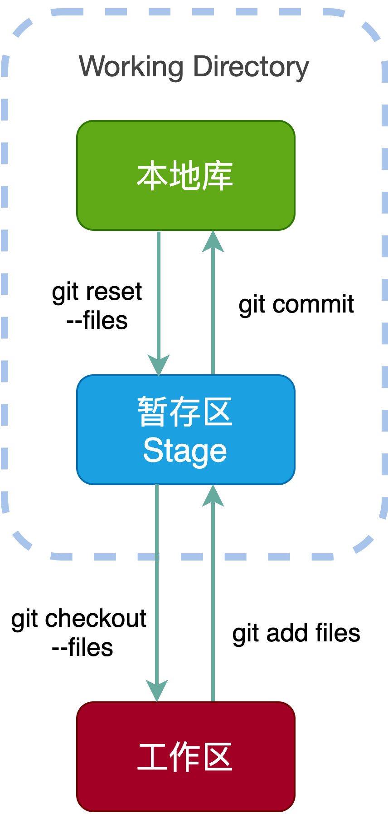
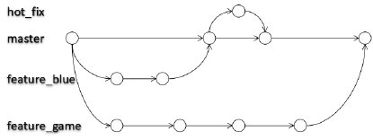

Git 属于分布式版本控制系统，而 SVN 属于集中式。

集中式版本控制只有中心服务器拥有一份代码，而分布式版本控制每个人的电脑上就有一份完整的代码。

集中式版本控制有安全性问题，当中心服务器挂了所有人都没办法工作了。

集中式版本控制需要连网才能工作，如果网速过慢，那么提交一个文件会慢的无法让人忍受。而分布式版本控制不需要连网就能工作。

分布式版本控制新建分支、合并分支操作速度非常快，而集中式版本控制新建一个分支相当于复制一份完整代码。

<!-- more -->

## 工作流

新建本地仓库后，当前目录成为了工作区，工作区下的影藏目录` .git`，就是Git的版本库。

Git 的版本库有一个称为 Stage 的暂存区以及最后的 History 版本库，History 存储所有分支信息，使用一个 HEAD 指针指向当前分支。




## Git命令行操作

### 本地库初始化

`Git init`

.git目录存放的是本地库相关的子目录和文件，不要删除也不要改动里面的文件

### 设置签名

形式：username ：aaa ，email：bbb@s.com

作用：区分不同的开发人员

辨析：这里的签名和远程(代码托管中心)的账号没有关系

命令：

- 项目级别、仓库级别：仅在当前本地库范围有效
  - `git config user.name lishouxian`
  - `git config user.email li.shouxian@outlook.com`
- 系统级别：在当前系统都有效
  - `git config --global user.name lishouxian`
  - `git config --global user.email li.shouxian@outlook.com`
- 优先使用仓库和项目级别

位置：项目级别存在于`./.git/config`文件，系统级别存在于`~/.gitconfig`文件。

## 基本操作

```shell
shouxian@iMac Git % git status
#位于某个branch，master
On branch master
#没有提交了的文件
No commits yet
#没有文件可以提交
nothing to commit (create/copy files and use "git add" to track)
```

咋文件目录下创建一个文件`good.txt`

- use "git add <file>..." to include in what will be committed

```shell
shouxian@iMac Git % vim good.txt
shouxian@iMac Git % git status
On branch master

No commits yet
#未加到status的文件
#未追中的文件
Untracked files:
  (use "git add <file>..." to include in what will be committed)
	good.txt

nothing added to commit but untracked files present (use "git add" to track)
```

use "git rm --cached <file>..." to unstage

```shell
shouxian@iMac Git % git add good.txt
shouxian@iMac Git % git status
On branch master
No commits yet
#将要提交的文件为good.txt
Changes to be committed:
  (use "git rm --cached <file>..." to unstage)
	new file:   good.txt
```

- git commit 完成一次提交

```shell
shouxian@iMac Git % git commit good.txt
[master (root-commit) 82da81c] 第一次提交
 1 file changed, 0 insertions(+), 0 deletions(-)
 create mode 100644 good.txt
shouxian@iMac Git % 
```

git commit -m "commit another" -a 更新的文件直接添加几条

```shell
shouxian@iMac Git % vim good.txt
shouxian@iMac Git % git status
On branch master
Changes not staged for commit:
#将文件添加到
  (use "git add <file>..." to update what will be committed)
  (use "git restore <file>..." to discard changes in working directory)
	modified:   good.txt
#添加+提交，或者直接提交
no changes added to commit (use "git add" and/or "git commit -a")
#直接提交
shouxian@iMac Git % git commit -m "commit another" -a
[master 86e5f76] commit another
 1 file changed, 1 insertion(+)
```

- 显示日志：`git log --oneline`

```shell
shouxian@iMac Git % git log --oneline
86e5f76 (HEAD -> master) commit another
82da81c 第一次提交
```

## 版本操作

1. #### 前进后退

- 基于索引值操作[推荐] 
  - git reset --hard [局部索引值]
  - git reset --hard a6ace91

```shell
shouxian@iMac Git % git log --oneline
86e5f76 (HEAD -> master) commit another
82da81c 第一次提交
shouxian@iMac Git % git reset --hard 82da81c
HEAD is now at 82da81c 第一次提交
```

- 使用^符号：只能后退
  - git reset --hard HEAD^ 
  - 注：一个^表示后退一步，n 个表示后退 n 步 

```shell
shouxian@iMac Git % git reset --hard 86e5f76
HEAD is now at 86e5f76 commit another
shouxian@iMac Git % git reset --hard HEAD^ 
HEAD is now at 82da81c 第一次提交
```

- 使用~符号：只能后退 
  - git reset --hard HEAD~n 
  - 注：表示后退 n 步
  
```shell
shouxian@iMac Git % git log --oneline
6bfdad0 (HEAD -> master) 第三次提交
86e5f76 commit another
82da81c 第一次提交
shouxian@iMac Git % git reset --hard HEAD~2 
HEAD is now at 82da81c 第一次提交
```

2. #### 前进后退的三个参数

- --soft 参数 

   仅仅在本地库移动 HEAD 指针 

- --mixed 参数 

   在本地库移动 HEAD 指针 

   重置暂存区 

-  --hard 参数 

   在本地库移动 HEAD 指针 

   重置暂存区 

   重置工作区

3. #### 删除文件并找回

- 前提:删除前，文件存在时的状态提交到了本地库。

- 操作:git reset --hard [指针位置]

  删除操作已经提交到本地库:指针位置指向历史记录  删除操作尚未提交到本地库:指针位置使用HEAD

4. #### 比较文件差异

- git diff [文件名]

  将工作区中的文件和暂存区进行比较

```shell
shouxian@iMac Git % git diff
diff --git a/hello.txt b/hello.txt
index e6076a0..91e28e3 100644
--- a/hello.txt
+++ b/hello.txt
@@ -1 +1,2 @@
你好
+i'm lishouxian.
```

- git diff [本地库中历史版本] [文件名]

  将工作区中的文件和本地库历史记录比较

- 不带文件名比较多个文件

## 分支管理

在版本控制中，使用多条线同时推进，这就叫做分支



### 分支的好处

- 同时并行推进多个功能开发，提高开发效率

- 各个分支在开发过程中，如果某一个分支开发失败，不会对其他分支有任何影响。失败的分支删除重新开始即可。

### 分支的操作

1. 创建分支 `git branch game`
2. 查看分支`git branch -v`
3. 切换分支`git checkout game`

```shell
shouxian@iMac Git % git branch game
shouxian@iMac Git % git branch -v
  game   6bfdad0 第三次提交
* master 6bfdad0 第三次提交
shouxian@iMac Git % git checkout game
M	hello.txt
Switched to branch 'game'
```

4. 合并分支`git merge`
   - 切换到接受合并的分支上
   - 执行merge命令

```shell
shouxian@iMac Git % git checkout master
M	hello.txt
Already on 'master'

shouxian@iMac Git % git merge game
Already up to date.
```

5. 解决冲突

- 第一步:编辑文件，删除特殊符号

- 第二步:把文件修改到满意的程度，保存退出

- 第三步:git add [文件名]

- 第四步:git commit -m "日志信息"

  注意:此时commit一定不能带具体文件名

```
<<<<<<< HEAD
你好
i'm lishouxian.
what is your name
=======
你好 wodetain
>>>>>>> game
```

6. 解决完冲突后提交

```shell
shouxian@iMac Git % git commit -m "merge" -a     
[master 4bb4ba3] merge
shouxian@iMac Git % git log --oneline
4bb4ba3 (HEAD -> master) merge
d10885c (game) game edit
741e459 master edit
6bfdad0 第三次提交
86e5f76 commit another
82da81c 第一次提交
```


