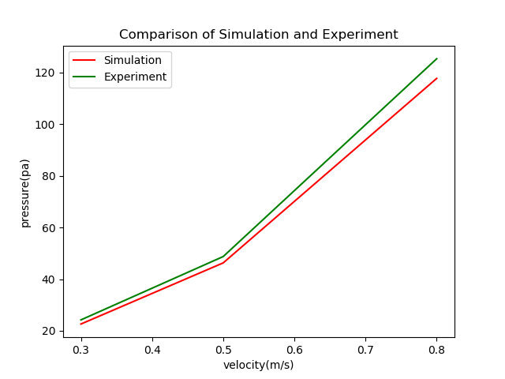
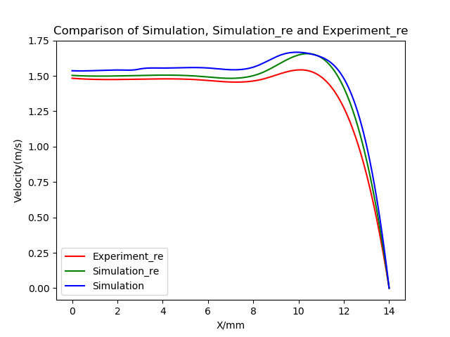
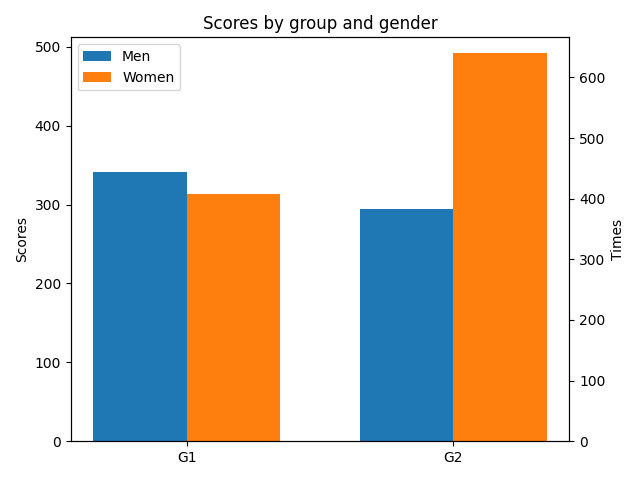

使用Python绘图我们最常用到的库是Matplotlib，下面就是简单的绘图结果示例。

### 折线图

```Python
import matplotlib.pyplot as plt

plt.plot([0.3, 0.5, 0.8], [22.623, 46.316, 117.76], 'r', label='Simulation')
plt.plot([0.3, 0.5, 0.8], [24.23, 48.77, 125.37], 'g', label='Experiment')
plt.title("Comparison of Simulation and Experiment")
plt.xlabel("velocity(m/s)")
plt.ylabel("pressure(pa)")
plt.legend()
plt.savefig("Com_s_e.png")
plt.show()
```

<!-- more -->




### 平顺折线

```Python
import matplotlib.pyplot as plt
import numpy as np
x1 = np.array([0,2.8,5.6,8.4,11.2,14])
y1 = np.array([1.483,1.476,1.472,1.476,1.465,0])
y11 = np.array([1.503,1.502,1.497,1.523,1.605,0])
x2 = np.array([0,1.01,2.16,2.91,2.94,3.95,4.99,6.05,7.03,8.09,9.30,10.71,12.21,14.00])
y2 = np.array([1.536,1.537,1.541,1.546,1.547,1.555,1.558,1.555,1.543,1.566,1.652,1.648,1.416,0])

from scipy.interpolate import make_interp_spline
x1new = np.linspace(x1.min(),x1.max(),300)
y1_new = make_interp_spline(x1,y1)(x1new)
y11_new = make_interp_spline(x1,y11)(x1new)
x2new = np.linspace(x2.min(),x2.max(),300)
y2_new = make_interp_spline(x2,y2)(x2new)

plt.plot(x1new,y1_new, 'r', label='Experiment_re')
plt.plot(x1new,y11_new,'g', label='Simulation_re')
plt.plot(x2new,y2_new,'b', label='Simulation')

plt.title("Comparison of Simulation, Simulation_re and Experiment_re")
plt.xlabel("X/mm")
plt.ylabel("Velocity(m/s)")
plt.legend()
plt.savefig("Com_e.png")
plt.show()

```



### 柱状图

```Python
import matplotlib.pyplot as plt
import numpy as np


labels = ['G1', 'G2']
future1 = [341.6, 294.6]
rate = 1.3 #变量1相对于变量2的数值之比
future2 = [407/rate, 639/rate]
width = 0.35  # 柱的宽度

x = np.arange(len(labels))  # 不用管
fig, ax = plt.subplots()

rects1 = ax.bar(x - width/2, future1, width, label='Men')
rects2 = ax.bar(x + width/2, future2, width, label='Women')

# Add some text for labels, title and custom x-axis tick labels, etc.
ax.set_ylabel('Scores')
ax.set_title('Scores by group and gender')
ax.set_xticks(x)
ax.set_xticklabels(labels)
max_men = max(future1)
high = 1.5 #坐标轴的高度
ax.set_ylim(0, int(max_men * high))
ax.legend()


ax2 = ax.twinx()
ax2.set_ylim(0, int(max_men * high * rate))
ax2.set_ylabel("Times")

plt.show()
```

