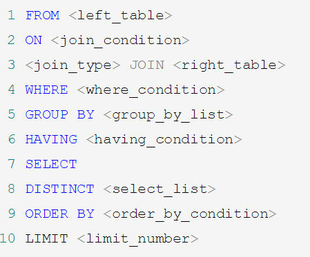

### MySQL中文字符乱码的问题

1. 修改配置文件

```shell
vim /etc/myconf
```

2. 修改已创建库和表的字符集

```shell
alter database mydb character set 'utf-8';
```

2. Update

### MySQL存储引擎

MyISAM和InnoDB

|        | MyISAM     | InnoDB       |
| ------ | ---------- | ------------ |
| 事务   | 不支持     | 支持         |
| 外键   | 不支持     | 支持         |
| 缓存   | 只缓存索引 | 都缓存       |
| 行表锁 | 表锁       | 行锁，粒度小 |

<!-- more -->

### SQL的执行顺序

- 手写


- 机读

随着SQL版本的更新，其优化器也在不断升级，优化器会分析不同的执行顺序产生的性能消耗不同而动态调整执行顺序



## 数据库索引

### 性能下降的解决办法

- 数据过多 ->分库分表
- 关联了太多的表，太多的join  ->SQL优化
- 没有充分应用到索引 ->索引建立
- 服务器调优及各个参数‘

### 索引简介

#### 是什么

索引(index)是帮助MySQL高效获取数据的数据结构，即索引的本质是数据结构

简单理解索引，“排好序德邦快速查找数据结构”

#### 优势

- 提高数据检索的效率，降低数据库的IO成本
- 通过索引列队数据进行排序，降低数据排序的成本，降低CPU的消耗

#### 劣势

- 大大降低更新表的速度
- 需要添加更加的空间

#### MySQL的索引结构

- Btree索引

- B+tree索引

- 聚簇索引和非聚簇索引

  - B+tree索引是聚簇索引，他指的是数据航与相邻的键值聚簇在一起

### 索引的建立

#### 普通索引

```mysql
CREATE INDEX indexName ON table_name (column_name)
```

一般情况下创建的语句如下所示：索引的名称为`idx_` + `column_name`

```mysql
CREATE INDEX idx_c4 ON t(c4);
```

#### 主键索引

设定为主键后数据库会自动创建索引

```mysql
ALTER TABLE `table_name` ADD PRIMARY KEY ( `column` )
```

#### 复合索引

```mysql
ALTER TABLE `table_name` ADD INDEX index_name ( `column1`, `column2`, `column3` )
```

### 创建索引的情况

- 主键自动创建唯一索引
- 频繁作为查询条件的字段应该创建索引
- 查询中与其他字段关联的字段，外键关系建立索引
- 单键/组合索引的选择问题，组合索引性价比更高
- 查询中排序的字段，排序字段若通过索引去访问将大大提高排序速度
- 查询中统计或者分组字段

### 不创建索引的情况

- 表记录太少
- 经常增删改查
- where条件里面用不到的字段
- 过滤性不好的字段

## 性能优化

### 索引失效的可能性

- 全值匹配我最爱
- 最佳左前缀法则：如果索引了多列，要遵守最佳左前缀法则，指的是查询从索引的最坐前列开始并且不跳过索引中的列
- 不在索引列上进行任何操作(计算，函数(自动or手动)类型转换，会导致索引失效而转向全表扫描)
- 存储硬气不能使用索引中范围条件右边的列
- MySQL在使用不等于的时候无法使用索引会导致全表扫描
- is not null也无法使用索引，但是is null是可以使用索引的
- like一通配符开头('%abc...')MySQL会索引失效变成全表扫描
- 字符串不加单引号会导致索引失效

### 一般建议

- 对于单键索引，尽量选择针对当前query过滤性更好的索引
- 在选择组合索引的时候，当前Query中过滤性最好的字段在索引字段顺序中，位置越靠前越好
- 在选择组合索引的时候，尽量选择可以报好当前query中的where字句中跟多字段的索引
- 在选择组合索引的时候，如果某个字段可能出现范围查询，尽量把这个字段放在索引次序最低的位置
- 书写SQL语句时，应尽量避免索引失效

## MySQL复制

### 主从复制


1. master将改变记录到二进制日志(binary log)。这些记录的过程叫做二进制日志事件(binary log events)
2. slave将master的二进制日志事件(binary log events)拷贝到他的中继日志(relay log)
3. slave重做中继日志中的事件，将改变应用到自己的数据库中，MySQL复制是异步的且串行化的

### 读写分离


主服务器处理写操作以及实时性要求比较高的读操作，而从服务器处理读操作。

读写分离能提高性能的原因在于：

- 主从服务器负责各自的读和写，极大程度缓解了锁的争用；
- 从服务器可以使用 MyISAM，提升查询性能以及节约系统开销；
- 增加冗余，提高可用性。

读写分离常用代理方式来实现，代理服务器接收应用层传来的读写请求，然后决定转发到哪个服务器。


