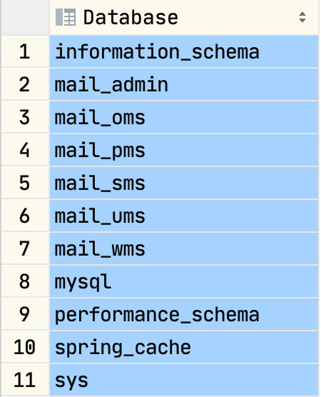
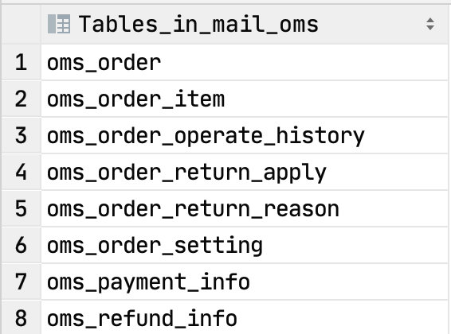
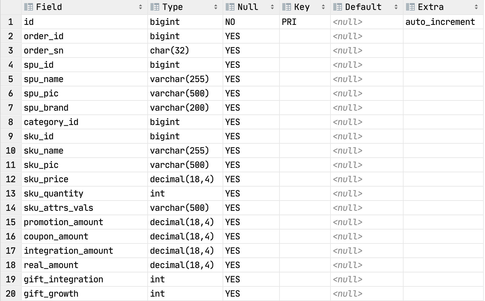

### SQL概述 

SQL，一般发音为sequel，SQL的全称Structured Query Language)，SQL用来和数据库打交道，完成和数据库的通信，SQL是一套标准。但是每一个数据库都有自己的特性别的数据库没有,当使用这个数据库特性相关的功能,这时SQL语句可能就不是标准了.(90%以上的SQL都是通用的)

### 什么是数据库 

数据库，通常是一个或一组文件，保存了一些符合特定规格的数据,数据库对应的英语单词是DataBase,简称:DB,数据库软件称为数据库管理系统（DBMS），全称为DataBase Management System，如：Oracle、SQL Server、MySql、Sybase、informix、DB2、interbase、PostgreSql 。

<!-- more -->

### MySql概述 

MySQL最初是由“MySQL AB”公司开发的一套关系型数据库管理系统（RDBMS-Relational Database Mangerment System）。

MySQL不仅是最流行的开源数据库，而且是业界成长最快的数据库，每天有超过7万次的下载量，其应用范围从大型企业到专有的嵌入应用系统。

MySQL AB是由两个瑞典人和一个芬兰人：David Axmark、Allan Larsson和Michael “Monty” Widenius在瑞典创办的。

在2008年初，Sun Microsystems收购了MySQL AB公司。在2009年，Oracle收购了Sun公司，使MySQL并入Oracle的数据库产品线。 

### 表

表(table)是一种**结构化的文件**，可以用来存储特定类型的数据，如：学生信息，课程信息，都可以放到表中。另外表都有特定的名称，而且不能重复。表中具有几个概念：列、行、主键。 列叫做字段(Column),行叫做表中的记录,每一个字段都有:字段名称/字段数据类型/字段约束/字段长度

| 学号（主键） | 姓名 | 性别 | 年龄 |
| ------------ | ---- | ---- | ---- |
| 00001        | 张三 | 男   | 20   |

### SQL的分类

**数据查询语言(DQL-Data Query Language)** 

**代表关键字:select** 

**数据操纵语言(DML-Data Manipulation Language)**

**代表关键字:insert,delete,update**

数据定义语言(DDL-Data Definition Language)

代表关键字:create ,drop,alter,

事务控制语言(TCL-Transactional Control Language)

代表关键字:commit ,rollback;

数据控制语言(DCL-Data Control Language)

代表关键字:grant,revoke.

## 常见命令

### 创建数据库

`create database 数据库名称`

`use 数据库名称`

### 查询当前使用的数据库

`select database();`

查询数据库版本也可以使用

`select  version();`

### 终止一条语句

如果想要终止一条正在编写的语句，可键入\c。

### 退出mysql

可使用\q、QUIT或EXIT：

如：

`mysql> \q (ctrl+c)`

### 查看表结构

```mysql
show databases; #查看和指定现有的数据库
```



```mysql
use mail_oms; #指定当前缺省数据库
```

mail_pms> use mail_oms
[2020-09-19 21:59:20] completed in 142 ms

```mysql
show tables  #查看当前库中的表
```



```mysql
desc oms_order_item; #查看表的结构
```



```mysql
show create table <table name>; #查勘表的创建语句
```

## 查询

### 简单查询

```mysql
#查询一个字段
select ename from emp;
#查询多个字段
select empno, ename from emp;
#查询全部字段
select * from emp;
```

采用select * from emp，虽然简单，但是*号不是很明确，建议查询全部字段将相关字段写到select语句的后面,在以后java连接数据库的时候,是需要在java程序中编写SQL语句的,这个时候编写的SQL语句不建议使用select * 这种形式,建议写明字段,这样可读性强.

```mysql
列出员工的编号，姓名和年薪
select empno, ename, sal*12 from emp;
select empno as ‘员工编号’, ename as ‘员工姓名’, sal*12 as ‘年薪’ from emp;
注意:字符串必须添加单引号 | 双引号
可以采用as关键字重命名表字段，其实as也可以省略，如：
select empno  "员工编号", ename  "员工姓名", sal*12  "年薪" from emp;

```

### 条件查询

条件查询需要用到where语句，where必须放到from语句表的后面

支持如下运算符

| 运算符           | 说明                                                         |
| ---------------- | ------------------------------------------------------------ |
| =                | 等于                                                         |
| <>或!=           | 不等于                                                       |
| <                | 小于                                                         |
| <=               | 小于等于                                                     |
| >                | 大于                                                         |
| >=               | 大于等于                                                     |
| between … and …. | 两个值之间,**等同于 >= and <=**                              |
| is null          | 为null（is not null 不为空）                                 |
| **and**          | 并且                                                         |
| **or**           | 或者                                                         |
| in               | 包含，相当于多个or（not in不在这个范围中）                   |
| not              | not可以取非，主要用在is 或in中                               |
| like             | like称为模糊查询，支持%或下划线匹配  %匹配任意个字符  下划线，一个下划线只匹配一个字符 |

### 排序数据

单一字段排序

排序采用order by子句，order by后面跟上排序字段，排序字段可以放多个，多个采用逗号间隔，order by默认采用升序，如果存在where子句那么order by必须放到where语句的后面

```mysql
按照薪水由小到大排序(系统默认由小到大)
select * from emp order by sal;
取得job为MANAGER的员工，按照薪水由小到大排序(系统默认由小到大)
select * from emp where job='MANAGER' order by sal;
如果包含where语句order by必须放到where后面，如果没有where语句order by放到表的后面
# select * from emp order by sal where job='MANAGER'; 错误示范
按照多个字段排序，如：首先按照job排序，再按照sal排序
select * from emp order by job,sal;
手动指定按照薪水由小到大排序
select * from emp order by sal asc;
手动指定按照薪水由大到小排序
select * from emp order by sal desc;
按照job和薪水倒序
select * from emp order by job desc, sal desc;
# 如果采用多个字段排序，如果根据第一个字段排序重复了，会根据第二个字段排序
按照薪水升序
select * from emp order by 6; #使用字段的位置来排序 不建议使用此种方式，采用数字含义不明确，程序不健壮

```

## 函数

#分组函数/聚合函数/多行处理函数

| 函数  | 含义       |
| ----- | ---------- |
| count | 取得记录数 |
| sum   | 求和       |
| avg   | 取平均     |
| max   | 取最大的数 |
| min   | 取最小的数 |

### count

```mysql
取得所有的员工数
select count(*) from emp;
取得津贴不为null员工数
select count(comm) from emp;
取得工作岗位的个数
select count(distinct job ) from emp;
```

### sum

- Sum可以取得某一个列的和，null会被忽略

```mysql
取得薪水的合计
select sum(sal) from emp;
取得津贴的合计
select sum(comm) from emp;
取得薪水的合计（sal+comm）
#select sum(sal+comm) from emp;
#comm字段有null值，所以无法计算，sum会忽略掉，正确的做法是将comm字段转换成0
select sum(sal+IFNULL(comm, 0)) from emp;
```

### avg

```mysql
取得平均薪水
select avg(sal) from emp;
```

### max/min

```mysql
取得最高薪水
select max(sal) from emp;
取得最晚入职得员工
select max(str_to_date (hiredate, '%Y-%m-%d')) from emp;
取得最低薪水
select min(sal) from emp;
取得最早入职得员工（可以不使用str_to_date转换）
select min(str_to_date(hiredate, '%Y-%m-%d')) from emp;
```

### 组合聚合函数

```mysql
可以将这些聚合函数都放到select中一起使用
select count(*),sum(sal),avg(sal),max(sal),min(sal) from emp;
```

## 分组查询

### group by

```mysql
取得每个工作岗位的工资合计，要求显示岗位名称和工资合计
select job, sum(sal) from emp group by job;

```

### having

```mysql
如果想对分组数据再进行过滤需要使用having子句
取得每个岗位的平均工资大于2000
select job, avg(sal) from emp group by job having avg(sal) >2000;
```

### select语句总结

一个完整的select语句格式如下

  select 字段  from 表名  where …….  group by ……..  having …….(就是为了过滤分组后的数据而存在的—不可以单独的出现)  order by ……..  

以上语句的执行顺序

1. 首先执行where语句过滤原始数据

2. 执行group by进行分组

3. 执行having对分组数据进行操作

4. 执行select选出数据

5. 执行order by排序

原则：能在where中过滤的数据，尽量在where中过滤，效率较高。having的过滤是专门对分组之后的数据进行过滤的。

## 连接查询

连接查询：也可以叫跨表查询，需要关联多个表进行查询

### SQL92语法，已经废弃

```mysql
显示每个员工信息，并显示所属的部门名称
select ename, dname from emp, dept;
#输出了56条数据，其实就是两个表记录的成绩，这种情况我们称为：“笛卡儿乘积”，出现错误的原因是：没有指定连接条件
select emp.ename, dept.dname from emp, dept where emp.deptno=dept.deptno;
也可以使用别名
select e.ename, d.dname from emp e, dept d where e.deptno=d.deptno;
#输出正确，因为加入了正确的连接条件
以上查询也称为 “内连接”，只查询相等的数据（连接条件相等的数据）
```

### SQL99语法

```mysql
采用SQL92语法：
select e.ename, e.sal, d.dname from emp e, dept d where e.deptno=d.deptno and  e.sal > 2000;
采用SQL99语法：
select e.ename, e.sal, d.dname from emp e join dept d on e.deptno=d.deptno where e.sal>2000;
或
select e.ename, e.sal, d.dname from emp e inner join dept d on e.deptno=d.deptno where e.sal>2000;
在实际中一般不加inner关键字
```

自连接

就是连接的两个表是同一个表：需要使用表的别名来区分。

### 外连接

#### 什么是外连接，与内连接有什么不同

- 内连接：
  - 假设A，B两张表进行连接，使用内联接，凡是A表与B表能够匹配上的记录查询出来，这就是内连接，AB两张表没有主次之分，两张表是平等的。
- 外连接：
  - 假设A，B两张表进行连接，使用外联接，AB两张表中有一张表是主表，一张表是副表，主要查询主表中的数据，捎带着查询副表的数据集，当附表中没有和主表匹配的数据的时候，副表会自动模拟出NULL与之匹配
- 外连接的分类
  - 左外连接：表示左边的这张表示主表
  - 有外连接：表示右边的这张表示主表


#### 语法

- 内连接
  - 表1  inner join  表2  on  关联条件
  
  - 做连接查询的时候一定要写上关联条件
  
  - inner 可以省略
    

- 外连接
  
   * 左外连接
     - 表1  left  outer  join  表2  on  关联条件
     - 做连接查询的时候一定要写上关联条件
     - outer  可以省略
   * 右外连接
     - 表1  right  outer  join  表2  on  关联条件
     - 做连接查询的时候一定要写上关联条件
     - outer  可以省略

```mysql

*左外连接（左连接）和右外连接（右连接）的区别：
*左连接以左面的表为准和右边的表比较，和左表相等的不相等都会显示出来，右表符合条件的显示,不符合条件的不显示
*右连接恰恰相反，以上左连接和右连接也可以加入outer关键字，但一般不建议这种写法，如：
select e.ename, e.sal, d.dname from emp e right outer join dept d on e.deptno=d.deptno;
select e.ename, e.sal, d.dname from dept d left outer join emp e on e.deptno=d.deptno;
左连接能完成的功能右连接一定可以完成

```

## 子查询

#### 在where语句中使用子查询

也就是在where语句中加入select语句

```mysql
查询员工编号包含管理者编号的
select empno, ename from emp where empno in(select mgr from emp where mgr is not null);
取得大于平均薪水的员工
select empno, ename, sal from emp where sal > (select avg(sal) from emp);
查询员工信息，查询哪些人是管理者，要求显示出其员工编号和员工姓名
首先取得管理者的编号，去除重复的
select distinct mgr from emp where mgr is not null;
将以上查询作为一张表，放到from语句的后面
使用92语法：
select e.empno, e.ename from emp e, (select distinct mgr from emp where mgr is not null) m where e.empno=m.mgr;
使用99语法：
select e.empno, e.ename from emp e join (select distinct mgr from emp where mgr is not null) m on e.empno=m.mgr;
```

#### 在from语句中使用子查询

可以将该子查询看做一张表

```mysql
1、首先取得各个部门的平均薪水
select deptno, avg(sal) avg_sal from emp group by deptno;


2、将部门的平均薪水作为一张表与薪水等级表建立连接，取得等级
select deptno,avg(sal) avg_sal from emp group by deptno;
select * from salgrade;
select a.deptno,a.avg_sal,g.grade from (select deptno,avg(sal) avg_sal from emp group by deptno ) a join salgrade g on a.avg_sal between g.losal and hisal;

```

练习：求每个部门平均的薪水等级：

1. 找出每个员工的薪水等级：

   `select e.ename,e.sal,e.deptna,s.grade from emp e join salgrade s on e.sal between s.losal and s.hisal`

2. 找出员工薪水等级的平均值

   `grope by e.dept.no`

#### Selcet 后面连接子查询：

```mysql
查询员工信息，并显示出员工所属的部门名称
第一种做法，将员工表和部门表连接
select e.ename, d.dname from emp e, dept d where e.deptno=d.deptno;
第二种做法，在select语句中再次嵌套select语句完成部分名称的查询
select e.ename, (select d.dname from dept d where e.deptno=d.deptno) as dname from emp e;

```

## 其他查询

### union

可以拼接两个不相关的表的连接取得前5条数据

  select * from emp limit 5;  

```mysql
查询job包含MANAGER和包含SALESMAN的员工
select * from emp where job in('MANAGER', 'SALESMAN');
采用union来合并
select * from emp where job='MANAGER'
union
select * from emp where job='SALESMAN'

```

### limit的使用

```mysql
select * from table limit m,n
其中m是指记录开始的index，从0开始，表示第一条记录
n是指从第m+1条开始，取n条。
select * from tablename limit 2,4
即取出第3条至第6条，4条记录
取得前5条数据
select * from emp  limit 5;
从第二条开始取两条数据
select * from emp  limit 1,2;
取得薪水最高的前5名 
select  * from emp e  order by e.sal desc limit 5;

```


