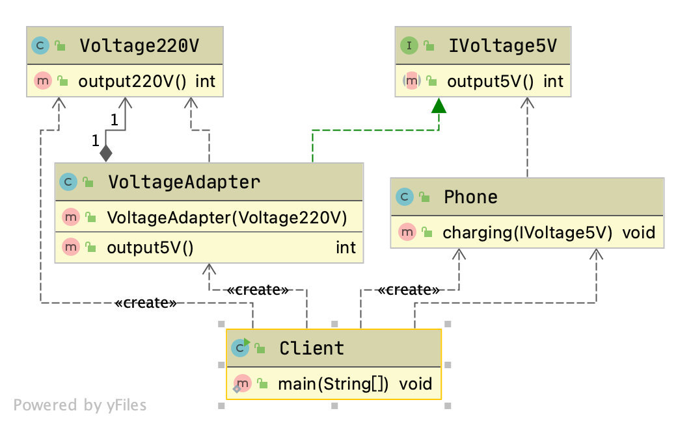

提高代码重用性(相同的代码，不用多次编写)

代码可读性(编程规范性，便于自己及其他程序猿的阅读和理解)

可扩展性(当需要增加新的功能的时候，非常的方便，可维护)

可靠性(程序不容易出错，可靠性高    )

使程序呈现高内聚，低耦合的特性

<!-- more -->

## 设计模式的七个原则：

### 单一职责原则

对一个类来说，一个类只负责一个职责，当类A负责两个职责的时候：职责A，和职责B的改变可能会使得另外一个职责出错。

- 降低类的复杂性
- 提高类的可读性，可维护性
- 降低变更引起的风险
- 通常情况下我们，**我们因当遵守单一职责原则**，只有逻辑足够简单才可以在代码级违反单一职责原则，只有类中的方法足够少的时候，可以在方法级别保持单一职责原则

### 接口隔离原则(Interface Segregation Principe)

客户端不应该依赖他不需要的接口，即一个类对另一个类的依赖应该建立在最小的接口上

举例：

类A通过接口Interface1依赖类B，但是只使用了接口的1，2，3方法。

类C通过接口Interface1依赖类D，但是只使用了接口的1，4，5方法。

但是此时类B和类D任然需要实现所有方法


将上述的接口1分解成三个接口，这样

类A通过接口Interface1和接口Interface2依赖类B

类C通过接口Interface1和接口Interface2依赖类D


### 依赖倒转原则(Dependence Inversion Principe)

1. 高层模块不要依赖底层模块，二者都应该依赖器抽象
2. 抽象不应该依赖细节，细节应该依赖抽象
3. 依赖倒转的思想是面对接口编程
4. 细节具有多变性，接口就稳定得多
5. 接口和抽象类的目的是定义好规范


依赖关系传递的三种方式和应用案例

1. 接口传递

```java
interface IOpenAndClose {
    public void open(ITV tv); //抽象方法,接收接口
}

interface ITV { //ITV接口
    public void play();
}


// 实现接口
class OpenAndClose implements IOpenAndClose{
    public void open(ITV tv){
        tv.play();
    }
}
class ChangHong implements ITV {
    @Override
    public void play() {
        // TODO Auto-generated method stub
        System.out.println("长虹电视机，打开");
    }
}
```

2. 构造器方法传递

```java
interface IOpenAndClose {
    public void open(); //抽象方法
}
interface ITV { //ITV接口
    public void play();
}
class OpenAndClose implements IOpenAndClose{
    public ITV tv; //成员
    public OpenAndClose(ITV tv){ //构造器
        this.tv = tv;
    }
    public void open(){
        this.tv.play();
    }
}

class ChangHong implements ITV {

    @Override
    public void play() {
        // TODO Auto-generated method stub
        System.out.println("长虹电视机，打开");
    }
}
```

3. setter方法传递

```java
interface IOpenAndClose {
    public void open(); // 抽象方法
    public void setTv(ITV tv);
}

interface ITV { // ITV接口
    public void play();
}

class OpenAndClose implements IOpenAndClose {
    private ITV tv;
    public void setTv(ITV tv) {
        this.tv = tv;
    }

    public void open() {
        this.tv.play();
    }
}

class ChangHong implements ITV {

    @Override
    public void play() {
        // TODO Auto-generated method stub
        System.out.println("长虹电视机，打开");
    }

}
```


依赖倒转原则的注意事项和细节

1. 底层模块尽量都要有抽象类或者接口，或者两者都有，这样程序的稳定性会更好。
2. 变量的声明类型尽量是抽象类和接口，这样我们的变量应用和实际对象间就存在一个缓冲层，利于程序的扩展和优化。
3. 遵循时遵循里氏替换原则。

### 里氏替换原则

oo中的继承性的思考和说明

1. 继承时包含这样一层含义：父类中凡是已经实现好的方法，实际上是在设定规范和七月，虽然他不强制要求所有的子类必要遵循这些七月，但是如果子类对这些已经实现的方法进行任意的修改，就会给整个继承梯子造成破坏。
2. 继承再给程序带来便利性的同时也带来了弊端。比如继承会给程序带来入侵性，程序的可移植性降低，增加对象之间的耦合性。
3. 如何正确的使用里氏替换原则

达到的效果。里氏替换原则告诉我们尽量不要重写父类中的方法，如果真的要替换，我们可以让原有的父类和子类都继承一个更加基础的基类


A和B的耦合关系被断开，提出一个新的base类来聚合AB两个类


### 开闭原则(Open Close Principe)

1. 开闭原则是编程中最基础最重要的设计原则
2. 一个软件实体例如类，模块和函数应该对扩展开放，对修改关闭(对使用方)。使用抽象来构建框架，使用实现来扩展细节。
3. 软件需要变化时是扩展软件的实体行为来实现变化，而不是修改已有的代码来实现变化。
4. 其他原则，以及使用设计模式的目的就是遵循开闭的原则


改进的思路：

把shape类做成抽象类，并提出一个抽象的draw方法，让子类去实现这个方法，有了新图形之后只要继承与shape类就可以了。

### 迪米特法则

基本介绍：

1. 一个对象应该与其他对象保持最少的了解
2. 类与类的关系越密切，耦合度越大
3. 又叫做最小知道原则，即一个类对自己依赖的类知道的越少越好，也就是说，对于被依赖的类不管有多么复杂，都尽量将逻辑封装在类的外部，对外除了提供public方法，不对外泄露任何信息
4. 迪米特法则有一个更加简单的定义：至于直接朋友通信。
5. 只要两个对象之间有耦合关系，我们就说这两个对象之间是朋友关系，其中我们成出现在成员变量，方法参数，方法返回值中的类为直接朋友。


- 迪米特法则降低了类之间的耦合
- 但是同时注意：由于每个类都减少了不必要的依赖，因此迪米特法则只是要求降低类之间耦合关系，并不是完全没有耦合关系。

### 合成复用原则


## 单例模式

### 静态常量饿汉式

可以使用，但是可能比较浪费内存。

```java
class Singleton {
   
   //1. 构造器私有化, 外部能new
   private Singleton() {
      
   }
   //2.本类内部创建对象实例
   private final static Singleton instance = new Singleton();
   
   //3. 提供一个公有的静态方法，返回实例对象
   public static Singleton getInstance() {
      return instance;
   }
   
}
```

### 静态代码快饿汉式

可以使用，但是可能比较浪费内存。

```java
class Singleton {
   
   //1. 构造器私有化, 外部能new
   private Singleton() {
      
   }

   //2.本类内部创建对象实例
   private  static Singleton instance;
   
   static { // 在静态代码块中，创建单例对象
      instance = new Singleton();
   }
   
   //3. 提供一个公有的静态方法，返回实例对象
   public static Singleton getInstance() {
      return instance;
   }
   
}
```

### 线程不安全懒汉式

不推荐使用，线程不安全

```java
class Singleton {
   private static Singleton instance;
   
   private Singleton() {}
   
   //提供一个静态的公有方法，当使用到该方法时，才去创建 instance
   //即懒汉式
   public static Singleton getInstance() {
      if(instance == null) {
         instance = new Singleton();
      }
      return instance;
   }
}
```

### 线程安全懒汉式

多线程不推荐使用，效率低

```java
// 懒汉式(线程安全，同步方法)
class Singleton {
   private static Singleton instance;
   
   private Singleton() {}
   
   //提供一个静态的公有方法，加入同步处理的代码，解决线程安全问题
   //即懒汉式
   public static synchronized Singleton getInstance() {
      if(instance == null) {
         instance = new Singleton();
      }
      return instance;
   }
}
```

### 同步代码块懒汉式

多线程不能使用，不能保证多线程的线程安全

```java
// 懒汉式(线程安全，同步方法)
class Singleton {
	private static Singleton instance;
	
	private Singleton() {}
	
	//提供一个静态的公有方法，加入同步处理的代码，解决线程安全问题
	//即懒汉式
	public static synchronized Singleton getInstance() {
		if(instance == null) {
			instance = new Singleton();
		}
		return instance;
	}
}
```

### DoubleCheck懒汉式

推荐使用，线程安全，效率高

```java
// 懒汉式(线程安全，同步方法)
class Singleton {
   private static volatile Singleton instance;
   
   private Singleton() {}
   
   //提供一个静态的公有方法，加入双重检查代码，解决线程安全问题, 同时解决懒加载问题
   //同时保证了效率, 推荐使用
   
   public static synchronized Singleton getInstance() {
      if(instance == null) {
         synchronized (Singleton.class) {
            if(instance == null) {
               instance = new Singleton();
            }
         }
         
      }
      return instance;
   }
}
```

### 静态内部类

推荐使用，线程安全，效率高

```java
// 静态内部类完成， 推荐使用
class Singleton {
   private static volatile Singleton instance;
   
   //构造器私有化
   private Singleton() {}
   
   //写一个静态内部类,该类中有一个静态属性 Singleton
   private static class SingletonInstance {
      private static final Singleton INSTANCE = new Singleton(); 
   }
   
   //提供一个静态的公有方法，直接返回SingletonInstance.INSTANCE
   
   public static synchronized Singleton getInstance() {
      
      return SingletonInstance.INSTANCE;
   }
}
```

### 枚举方法

推荐使用，线程安全，效率高

```java
//使用枚举，可以实现单例, 推荐
enum Singleton {
   INSTANCE; //属性
   public void sayOK() {
      System.out.println("ok~");
   }
}
```


单例模式一般使用在不需要建立多个对象，建立对象的开销大，或者需要保持对象的统一。

## 工厂模式

### 简单工厂模式


### 工厂方法模式


### 抽象工厂模式


## 原型模式

Java中Object类是所有类的根类，Object类提供了一个clone()方法，这个方法可以将一个Java随想复制衣服，但是实现clone的Java类必须要实现一个接口Cloneable，该接口表示该类能够复制且具有复制的能力->原型模式、

基本介绍：

1. 原型模式是指：使用原型实例指定创建对象的种类，并通过拷贝这些原型创建新的对象
2. 原型模式是一种创建设计模式，允许一个对象再创建一个可定制的对象，无需知道如何创建的细节。
3. 工作原理是：通过讲一个原型对象出啊到那个要发动创建的对象，这个要发动创建的对象通过请求原型对象拷贝他们字节来实施创建，即对象.clone()。

原型模式创建的两种方法：

- 重写clone方法

- 序列化+反序列化

```java
public class DeepProtoType implements Serializable, Cloneable{

   public String name; //String 属性
   public DeepCloneableTarget deepCloneableTarget;// 引用类型
   public DeepProtoType() {
      super();
   }
   
   
   //深拷贝 - 方式 1 使用clone 方法
   @Override
   protected Object clone() throws CloneNotSupportedException {
      
      Object deep = null;
      //这里完成对基本数据类型(属性)和String的克隆
      deep = super.clone(); 
      //对引用类型的属性，进行单独处理
      DeepProtoType deepProtoType = (DeepProtoType)deep;
      deepProtoType.deepCloneableTarget  = (DeepCloneableTarget)deepCloneableTarget.clone();
      
      // TODO Auto-generated method stub
      return deepProtoType;
   }
   
   //深拷贝 - 方式2 通过对象的序列化实现 (推荐)
   
   public Object deepClone() {
      
      //创建流对象
      ByteArrayOutputStream bos = null;
      ObjectOutputStream oos = null;
      ByteArrayInputStream bis = null;
      ObjectInputStream ois = null;
      
      try {
         
         //序列化
         bos = new ByteArrayOutputStream();
         oos = new ObjectOutputStream(bos);
         oos.writeObject(this); //当前这个对象以对象流的方式输出
         
         //反序列化
         bis = new ByteArrayInputStream(bos.toByteArray());
         ois = new ObjectInputStream(bis);
         DeepProtoType copyObj = (DeepProtoType)ois.readObject();
         
         return copyObj;
         
      } catch (Exception e) {
         // TODO: handle exception
         e.printStackTrace();
         return null;
      } finally {
         //关闭流
         try {
            bos.close();
            oos.close();
            bis.close();
            ois.close();
         } catch (Exception e2) {
            // TODO: handle exception
            System.out.println(e2.getMessage());
         }
      }
   }
}
```

## 建造者模式-不太懂

建造者模式的四个角色：

1. product(产品对象)：一个具体的产品对象
2. builder(抽象建造者)：创建一个product对象的各个指定的接口、抽象类
3. ConcreteBuilder(具体建造者)：实现接口，构建和装配各个部件。
4. Direcrtor(指挥者)：构建一个使用builder接口的对象。它主要是用于创建一个复杂对象。它主要由两个作用，一是：隔离了客户与对象的生产过程，二是：负责控制产品对象的生产过程


## 适配器模式(Adapter Pattern)

基本介绍：

1. 适配器模式将某个类的接口转换成客户期望的另一个接口表示，主要目的是兼容性，让原本因接口不匹配不能在一起工作的两个类可以协同工作，其别名为包装器
2. 适配器属于结构型模型
3. 主要分为三类：类适配器模式，对象适配器模式，接口适配器模式

工作原理：

1. 适配器模式：将一个类的接口转换成另一种接口，让原本接口不兼容的类可以兼容
2. 从用户的角度是看不到被适配器，是解耦的
3. 从用户调用适配器转化出来的目标接口方法，适配器再调用被适配者的相关的接口 
4. 用户收到反馈，感觉自己只是与目标交互

### 类适配器


代码实现：

```java
//适配接口
public interface IVoltage5V {
   public int output5V();
}
```

```java
//被适配的类
public class Voltage220V {
   //输出220V的电压
   public int output220V() {
      int src = 220;
      System.out.println("电压=" + src + "伏");
      return src;
   }
}
```

```java
//适配器类
public class VoltageAdapter extends Voltage220V implements IVoltage5V {

   @Override
   public int output5V() {
      // TODO Auto-generated method stub
      //获取到220V电压
      int srcV = output220V();
      int dstV = srcV / 44 ; //转成 5v
      return dstV;
   }
}
```

```java
public class Phone {

   //充电
   public void charging(IVoltage5V iVoltage5V) {
      if(iVoltage5V.output5V() == 5) {
         System.out.println("电压为5V, 可以充电~~");
      } else if (iVoltage5V.output5V() > 5) {
         System.out.println("电压大于5V, 不能充电~~");
      }
   }
}
```

1. java是单继承机制，所以类适配器需要继承src类这一点是一个缺点，要求dst必须是一个接口，有一定的局限性
2. src类的方法在Adapter中都会暴露出来，也增加了使用的成本
3. 由于继承了src类，所以可以根据要求重写src的方法，使得Adapter的灵活度增加了

### 对象适配器


```java
//适配器类
public class VoltageAdapter  implements IVoltage5V {

   private Voltage220V voltage220V; // 关联关系-聚合
   //通过构造器，传入一个 Voltage220V 实例
   public VoltageAdapter(Voltage220V voltage220v) {
      this.voltage220V = voltage220v;
   }

   @Override
   public int output5V() {
      
      int dst = 0;
      if(null != voltage220V) {
         int src = voltage220V.output220V();//获取220V 电压
         System.out.println("使用对象适配器，进行适配~~");
         dst = src / 44;
         System.out.println("适配完成，输出的电压为=" + dst);
      }
      return dst;
      
   }

}
```



### 接口适配器

```java
//在AbsAdapter 我们将 Interface4 的方法进行默认实现
public abstract class AbsAdapter implements Interface4 {

   //默认实现
   public void m1() {

   }

   public void m2() {

   }

   public void m3() {

   }

   public void m4() {

   }
}
```

